# mini-claude-code changelog

## s01 Agent Loop

**教学分支：** `s01-agent-loop`

### 问题

LLM 只能输出文本，无法操作真实环境。一个编码 Agent 最小需要什么？

### 功能

一个 Bash 工具 + 一个 ReAct 循环 = 最小 Agent。

新增（18 个文件）：

- **消息模型**：`ContentBlock`（抽象基类）、`TextBlock`、`ThinkingBlock`、`ToolUseBlock`、`ToolResultBlock`、`UnknownBlock`、`Message`、`AssistantMessage`
- **工具接口**：`Tool`（接口，`getDefinition()` + `execute()`）、`ToolDefinition`、`ToolResult`
- **LLM 客户端**：`LlmClient`（接口）、`AnthropicLlmClient`（Hutool HTTP 实现）、`AnthropicConfig`
- **循环**：`AgentLoop`（主循环，101 行）、`AgentLoopListener`（回调接口）
- **工具**：`BashTool`（唯一真实工具，`/bin/sh -c <command>`）

### 设计

采用 ReAct 模式，循环不关心工具是什么，只做三件事：

```text
LLM → tool_use → execute → tool_result → LLM → ... → 文本回复
```

1. 把用户输入追加到 history（history 由外部 demo 管理，支持连续对话）
2. 调用 `LlmClient.chat()`，带上历史消息和工具定义
3. 模型返回 `tool_use`（通过 `stop_reason == "tool_use"` 判断）→ 按名称从内部 `Map<String, Tool>` 找到工具执行 → 结果包装成 `tool_result` 追加到 history → 回到步骤 2
4. 模型返回其他 `stop_reason`（如 `end_turn`）→ 循环结束，返回 `AssistantMessage`

关键设计决策：

- **只用内部 Map 做 dispatch**：不引入 ToolRegistry（留给 s02），AgentLoop 构造时把 `List<Tool>` 转成 `Map<String, Tool>`
- **不做权限判断**：BashTool 直接执行，不检查命令是否危险。权限边界留给 s03
- **不用 Anthropic SDK**：用 Hutool HTTP 直接调 Messages API，兼容 DeepSeek 等 Anthropic 兼容接口
- **保留 thinking block**：兼容接口可能返回 `thinking` 内容块，解析时保留 `thinking` 和 `signature`，在后续 assistant 历史中原样序列化回去


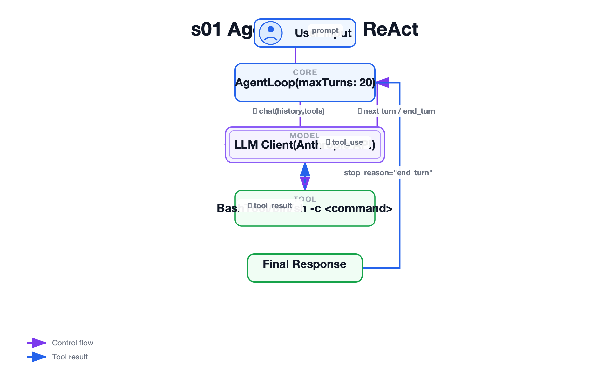

### 实现

`AgentLoop.run(List<Message> messages)` — 主循环，s01 分支真实代码（101 行）：

```java
public AssistantMessage run(List<Message> messages) {
    for (int turn = 0; turn < 20; turn++) {
        // 一轮 Agent 循环：LLM -> tool_use -> tool_result -> 下一轮 LLM
        AssistantMessage response = llmClient.chat(messages, toolDefinitions());
        listener.onAssistantMessage(response);
        messages.add(Message.assistant(response.getContent()));

        // 执行模型中请求的工具调用
        List<ToolResultBlock> toolResults = executeToolUses(response);
        if (!"tool_use".equals(response.getStopReason()) || toolResults.isEmpty()) {
            listener.onStop(response);
            return response;
        }

        // tool_result 以 user role 回传，这是 Anthropic Messages 协议要求
        messages.add(Message.toolResults(toolResults));
    }
    throw new IllegalStateException("Agent loop reached max turns");
}

private ToolResult executeTool(ToolUseBlock toolUse) {
    Tool tool = tools.get(toolUse.getName());  // s01：内部 Map dispatch，s02 会抽出 ToolRegistry
    if (tool == null) {
        return new ToolResult("Unknown tool: " + toolUse.getName());
    }
    return tool.execute(toolUse.getInput());
}
```

`BashTool.execute()` — s01 真实代码（ProcessBuilder，无超时）：

```java
public ToolResult execute(JSONObject input) {
    String command = input == null ? "" : input.getString("command");
    if (command == null || command.isBlank()) {
        return new ToolResult("No command provided");
    }
    try {
        Process process = new ProcessBuilder("/bin/sh", "-c", command)
                .directory(workdir)
                .redirectErrorStream(true)  // stderr 合并到 stdout
                .start();
        String output = readOutput(process);  // BufferedReader 逐行读
        int exitCode = process.waitFor();
        return new ToolResult("exit_code=" + exitCode + "\n" + output);
    } catch (IOException e) {
        return new ToolResult("Command failed to start: " + e.getMessage());
    } catch (InterruptedException e) {
        Thread.currentThread().interrupt();
        return new ToolResult("Command interrupted");
    }
}
```

### 遗留问题

- 工具 dispatch 逻辑（`Map<String, Tool>`）耦合在 AgentLoop 内部，没有抽成独立组件 → **s02 ToolRegistry** 解决
- 危险命令（`rm -rf /`）直接执行，没有权限闸门 → **s03 Permission** 解决
- 循环没有扩展点，日志/统计只能通过 Listener 硬编码在 demo 里 → **s04 Hooks** 解决

## s02 Tool Dispatch

**教学分支：** `s02-tool-dispatch`

### 问题

s01 只有一个 Bash 工具。加 `read_file`、`write_file` 就得改 AgentLoop，加越多改越多。怎么做到加工具不改循环？

另外，理论上 `cat`、`echo`、`sed`、`find` 都能用 bash 搞定，为什么不直接用 bash，还要加专用工具？

- **Token 开销**：bash 输出可能很长（`cat` 一个大文件），专用工具可以限制行数、截断，减少上下文浪费
- **可靠性**：`sed` 替换文本容易因正则转义出错，`edit_file` 只需传精确的 `old_text` 和 `new_text`，不依赖正则
- **安全性**：专用工具在代码层面做路径约束（canonical path 检查），bash 命令字符串更难审计，容易被注入
- **模型友好**：结构化的 `input_schema`（JSON Schema）比自然语言描述命令更不容易出错，模型也更擅长填写 JSON 参数

真实 Claude Code 有 **19 个工具**（bash、read、write、edit、glob、grep、task、todo_write、web_search、web_fetch、skill、ask_user_question 等），本章只加最具代表性的 4 个文件操作工具。

### 功能

引入 `ToolRegistry` 作为工具注册中心。加新工具只需实现 `Tool` 接口 + `registry.register()`，循环只负责按名字查找，不再关心工具是怎么来的。

新增：

- `ToolRegistry`：`LinkedHashMap` 实现，`register()` 返回 `this` 支持链式调用，`find()` 按名查找，`definitions()` 导出给 LLM
- `PathGuard`：路径安全组件，`resolve(path)` 做 canonical path 检查，防止 `../` 穿越
- `ReadFileTool`：读取 UTF-8 文本文件，支持 `limit` 限制行数
- `WriteFileTool`：写入文件内容，自动创建父目录
- `EditFileTool`：替换文件中精确文本的第一次出现
- `GlobTool`：按 glob pattern 查找文件

### 设计

```text
ToolRegistry
  bash       → BashTool
  read_file  → ReadFileTool
  write_file → WriteFileTool
  edit_file  → EditFileTool
  glob       → GlobTool
```

核心原则：**循环不变，只抽 dispatch**。s01 的 AgentLoop 内部用 `Map<String, Tool>` dispatch，s02 把它提取成独立的 `ToolRegistry` 类。ReAct 循环结构完全保留，唯一的改动是把 `tools.get(name)` 变成 `registry.find(name)`。

新增工具时只需两步，不改 AgentLoop：

1. 写一个实现 `Tool` 接口的类
2. 在 demo 里 `registry.register(new XxxTool(...))`

文件工具统一通过 `PathGuard` 做 workdir 路径约束——`PathGuard.resolve(path)` 将相对路径转为 canonical path，与 workdir 的 canonical path 做前缀比较，越界抛异常。所有文件工具在构造函数中创建 `new PathGuard(workdir)`，execute 时调用 `pathGuard.resolve(path)`。


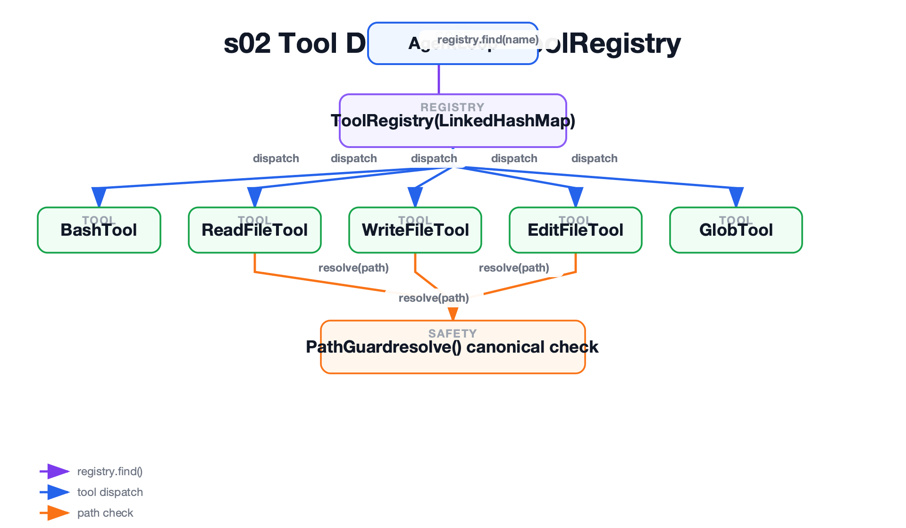

### 实现

`ToolRegistry` — `register()` 返回 `this`，支持链式调用：

```java
public class ToolRegistry {
    private final Map<String, Tool> tools = new LinkedHashMap<>();

    public ToolRegistry register(Tool tool) {
        tools.put(tool.getDefinition().getName(), tool);
        return this;
    }

    public Tool find(String name) {
        return tools.get(name);
    }

    public List<ToolDefinition> definitions() {
        List<ToolDefinition> definitions = new ArrayList<>();
        for (Tool tool : tools.values()) {
            definitions.add(tool.getDefinition());
        }
        return definitions;
    }
}
```

`PathGuard` — 所有文件工具的路径安全组件（s02 引入）：

```java
public class PathGuard {
    private final File workdir;

    public File resolve(String path) throws IOException {
        File target = new File(workdir, path).getCanonicalFile();
        if (!target.toPath().startsWith(workdir.getCanonicalFile().toPath())) {
            throw new IOException("Path escapes workspace: " + path);
        }
        return target;
    }
}
```

`ReadFileTool.execute()` — 委托 PathGuard 做路径校验，截断时追加剩余行数提示：

```java
public ToolResult execute(JSONObject input) {
    String path = input.getString("path");
    if (path == null || path.isBlank()) {
        return new ToolResult("Error: No path provided");
    }
    try {
        File target = pathGuard.resolve(path);
        Integer limit = input.getInteger("limit");
        List<String> lines = Files.readAllLines(target.toPath(), StandardCharsets.UTF_8);
        if (limit != null && limit > 0 && limit < lines.size()) {
            List<String> limited = new ArrayList<>(lines.subList(0, limit));
            limited.add("... (" + (lines.size() - limit) + " more lines)");
            lines = limited;
        }
        return new ToolResult(String.join("\n", lines));
    } catch (IOException e) {
        return new ToolResult("Error: " + e.getMessage());
    }
}
```

### 遗留问题

- 工具能执行什么就执行什么，没有权限闸门 → **s03 Permission** 解决
- 循环没有扩展点，日志、统计、权限判断还是得改 AgentLoop → **s04 Hooks** 解决

## s03 Permission

**教学分支：** `s03-permission`

### 问题

s02 的工具什么都能做——`rm -rf /`、写 `/etc/`、`chmod 777`，Agent 不会问你，直接执行。需要一个权限闸门，在工具执行前拦住危险操作。

### 功能

在工具执行前插入三层权限管线：硬拒绝 → 规则匹配 → 用户确认。危险命令直接拒绝，敏感操作需要用户点头。

新增：

- `PermissionManager`：按工具类型分发检查（bash → deny/ask，文件写入 → 越界检查，其他 → 直接放行）
- `PermissionDecision`：`allow()` 或 `deny(message)`，拒绝消息回传给模型
- `ApprovalPrompter`（接口）+ `ConsoleApprovalPrompter`（Scanner 读 y/N 的实现）

### 设计

PermissionManager 按工具类型分发，不是一股脑对所有工具做字符串匹配：

```text
PermissionManager.check(toolUse)
  ├─ tool == "bash"       → checkBash(): deny list → ask patterns → allow
  ├─ tool == "write_file" → checkFileWrite(): canonical path 越界检查
  │   或 "edit_file"
  └─ 其他工具              → 直接 allow()（read_file、glob 等不涉及破坏操作）
```

Bash 工具三道门：

```text
bash 命令 → 1. denyList 命中？（rm -rf /、sudo、shutdown、mkfs、dd if=、> /dev/sda）
                ├─ 命中 → deny()，不问用户
                └─ 未命中 → 2. askPatterns 命中？（rm 、> /etc/、chmod 777）
                                ├─ 命中 → ConsoleApprovalPrompter.approve()，等用户 y/N
                                └─ 未命中 → 3. allow()
```

文件写入工具只有一道门：路径 canonical 比较，越界直接 deny。

流程上，PermissionManager 插在 AgentLoop 的 tool_use 和 execute 之间：

```text
LLM → tool_use → PermissionManager.check() → 通过 → execute → tool_result
                                            → 拒绝 → 拒绝原因作为 tool_result
```

拒绝时不抛异常，而是把拒绝原因作为 `tool_result` 回传给模型，让模型看到为什么没执行。


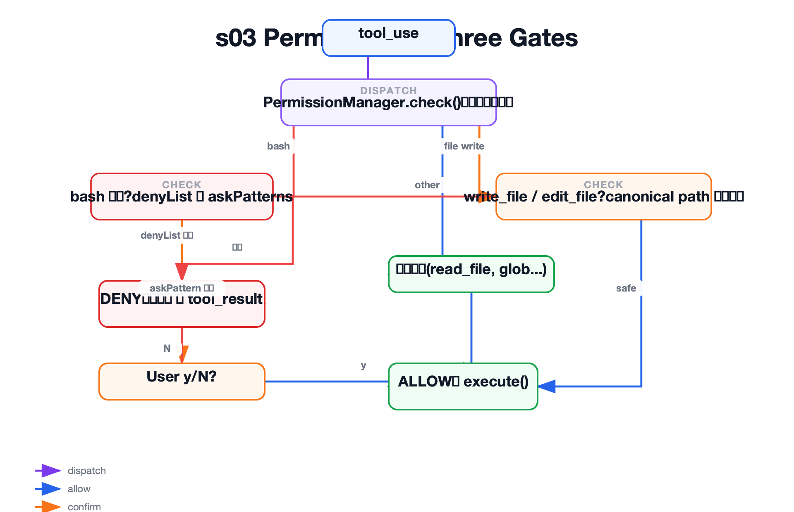

### 实现

`PermissionManager.check()` — 按工具类型分发：

```java
public PermissionDecision check(ToolUseBlock toolUse) {
    if ("bash".equals(toolUse.getName())) {
        return checkBash(toolUse);       // deny list + ask patterns
    }
    if ("write_file".equals(toolUse.getName()) || "edit_file".equals(toolUse.getName())) {
        return checkFileWrite(toolUse);  // canonical path 越界检查
    }
    return PermissionDecision.allow();   // read_file、glob 等直接放行
}

private PermissionDecision checkBash(ToolUseBlock toolUse) {
    String command = toolUse.getInput().getString("command");
    // 第一层：硬阻止列表（不问用户）
    for (String pattern : denyList) {
        if (command != null && command.contains(pattern)) {
            return PermissionDecision.deny("Permission denied: '" + pattern + "' is on the deny list");
        }
    }
    // 第二层：规则匹配 → 用户确认
    for (String pattern : askPatterns) {
        if (command != null && command.contains(pattern)) {
            return ask(toolUse, "Potentially destructive command");
        }
    }
    return PermissionDecision.allow();
}
```

`ConsoleApprovalPrompter` — 教学版审批器，只认 y/yes：

```java
public boolean approve(ToolUseBlock toolUse, String reason) {
    System.out.println("Permission> " + reason);
    System.out.println("Tool> " + toolUse.getName() + " " + toolUse.getInput());
    System.out.print("Allow? [y/N] ");
    String choice = scanner.nextLine().trim().toLowerCase();
    return "y".equals(choice) || "yes".equals(choice);
}
```

Demo 中挂载 PermissionManager：

```java
PermissionManager permissionManager = new PermissionManager(workdir, new ConsoleApprovalPrompter(scanner));
AgentLoop loop = new AgentLoop(new AnthropicLlmClient(config), registry, listener, permissionManager);
```

### 遗留问题

- 权限规则硬编码在 `PermissionManager` 里，加新规则要改核心代码 → **s04 Hooks** 可以把权限做成一个 hook，规则从循环中解耦
- 日志、统计、输出检查这些横切逻辑也混在循环或权限代码里 → **s04 Hooks** 提供统一扩展点

## s04 Hooks

**教学分支：** `s04-hooks`

### 问题

s03 的权限规则写在 `PermissionManager` 里，日志、统计、输出检查也都散落在 AgentLoop 各处。每加一个横切能力就得改主循环。怎么做到加能力不改循环？

### 功能

把横切逻辑从 AgentLoop 中解耦，在循环的固定位置挂事件钩子。权限、日志、输出检查都可以注册为 hook，循环只负责触发，不管逻辑。

新增：

- `Hook`：函数式接口 `HookDecision run(HookContext context)`
- `HookEvent`：常量类，四个事件点 `USER_PROMPT_SUBMIT`、`PRE_TOOL_USE`、`POST_TOOL_USE`、`STOP`
- `HookContext`：POJO，按事件类型选填字段（userPrompt / toolUse / toolResult / messages）
- `HookDecision`：`pass()` 放行或 `block(message)` 阻止，`isBlocked()` 判断
- `HookManager`：`Map<String, List<Hook>>` 存储，`register(event, hook)` 返回 this，`trigger(event, context)` 按序执行

### 设计

四个事件点，覆盖一次对话的完整生命周期：

```text
用户输入 → UserPromptSubmit（由 demo 外部触发，不在 AgentLoop 内）
工具执行前 → PreToolUse（权限检查、日志记录，可阻止执行）
工具执行后 → PostToolUse（输出日志，只读）
循环停止 → Stop（统计工具调用次数）
```

关键设计决策：

- **PreToolUse 可以阻止**：返回 `HookDecision.block(message)` 时，message 作为 tool_result 回传模型。后续同事件的 hook 不再触发（短路）
- **PostToolUse 只读**：工具已执行，hook 只能观察，不能撤销
- **UserPromptSubmit 在 AgentLoop 外触发**：由 demo 在调用 `loop.run()` 之前手动触发，因为 demo 负责接收用户输入，不是 AgentLoop 的职责
- **权限从 s03 的独立类迁移为 s04 的一个 hook**：s04 demo 中权限逻辑作为一个 `PreToolUse` hook 内联写在 `permissionHook()` 方法里，不再使用 `PermissionManager` 类。演示了「不改循环，只增减 hook」
- **Hook 内联在 demo 中**：教学版把 hook 写在入口类里，让读者一眼看到扩展点怎么挂上去


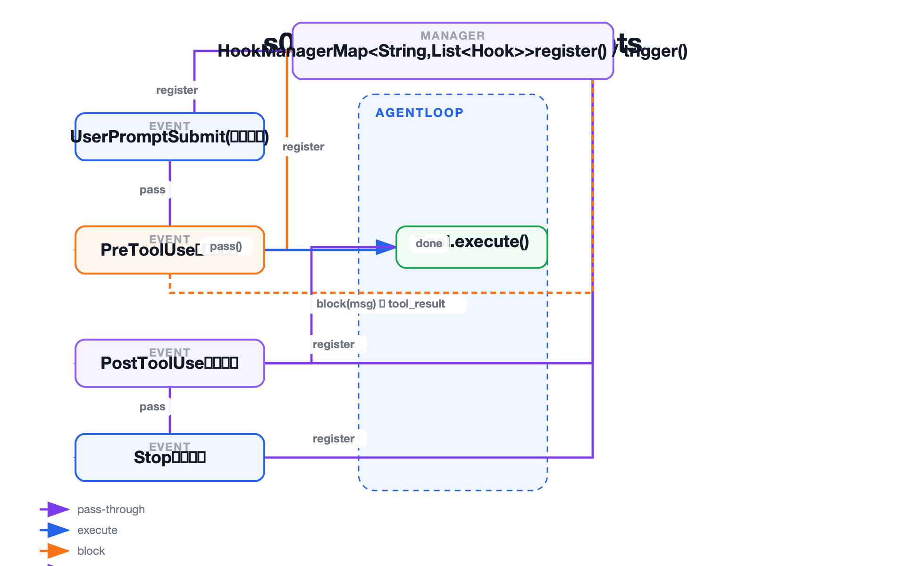

### 实现

`HookManager` — 按 String key 存储，`trigger()` 返回第一个 block 或最终 pass：

```java
public class HookManager {
    private final Map<String, List<Hook>> hooks = new LinkedHashMap<>();

    public HookManager register(String event, Hook hook) {
        hooks.computeIfAbsent(event, key -> new ArrayList<>()).add(hook);
        return this;
    }

    public HookDecision trigger(String event, HookContext context) {
        List<Hook> eventHooks = hooks.get(event);
        if (eventHooks == null) {
            return HookDecision.pass();
        }
        for (Hook hook : eventHooks) {
            HookDecision decision = hook.run(context);
            if (decision != null && decision.isBlocked()) {
                return decision;
            }
        }
        return HookDecision.pass();
    }
}
```

s04 中权限变为一个 hook（内联在 `permissionHook()` 方法，不再用 PermissionManager 类）：

```java
private static HookDecision permissionHook(HookContext context, Scanner scanner) {
    ToolUseBlock toolUse = context.getToolUse();
    if (!"bash".equals(toolUse.getName())) {
        return HookDecision.pass();  // 非 bash 工具直接放行
    }
    String command = toolUse.getInput().getString("command");
    // 硬阻止列表
    for (String pattern : Arrays.asList("rm -rf /", "sudo", "shutdown", "reboot", "mkfs", "dd if=")) {
        if (command.contains(pattern)) {
            return HookDecision.block("Permission denied by hook: " + pattern);
        }
    }
    // 规则匹配 → 用户确认
    for (String pattern : Arrays.asList("rm ", "> /etc/", "chmod 777")) {
        if (command.contains(pattern)) {
            System.out.print("Allow? [y/N] ");
            String choice = scanner.nextLine().trim().toLowerCase();
            if (!"y".equals(choice) && !"yes".equals(choice)) {
                return HookDecision.block("Permission denied by hook");
            }
        }
    }
    return HookDecision.pass();
}
```

Demo 中注册四类 hook：

```java
HookManager hooks = new HookManager();
hooks.register(HookEvent.USER_PROMPT_SUBMIT, ctx -> {
    System.out.println("[HOOK] UserPromptSubmit: working in " + workdir.getAbsolutePath());
    return HookDecision.pass();
});
hooks.register(HookEvent.PRE_TOOL_USE, ctx -> permissionHook(ctx, scanner));     // 权限
hooks.register(HookEvent.PRE_TOOL_USE, ctx -> {                                   // 日志
    System.out.println("[HOOK] PreToolUse: " + ctx.getToolUse().getName());
    return HookDecision.pass();
});
hooks.register(HookEvent.POST_TOOL_USE, ctx -> {                                  // 输出
    System.out.println("[HOOK] PostToolUse: " + ctx.getToolUse().getName());
    return HookDecision.pass();
});
hooks.register(HookEvent.STOP, ctx -> {                                           // 统计
    System.out.println("[HOOK] Stop: session used " + toolResultCount(ctx.getMessages()) + " tool calls");
    return HookDecision.pass();
});

AgentLoop loop = new AgentLoop(llmClient, registry, listener, hookManager);  // 不传 PermissionManager
```

### 遗留问题

- Agent 可以自由调用工具，但缺少任务规划能力，复杂任务容易边做边忘 → **s05 Todo** 解决

## s05 Todo

**教学分支：** `s05-todo`

### 问题

Agent 可以自由调用工具，但面对多步骤任务时没有计划能力——边做边忘，做到一半忘了下一步是什么。怎么让 Agent 先列计划再执行？

### 功能

把计划做成一个工具 `todo_write`，让模型显式写下当前任务列表和状态。循环不变，计划能力来自工具本身——延续 s02「加一个工具只加一个 handler」的原则。

新增：

- `TodoItem`：数据类，保存 `content` 和 `status`
- `TodoWriteTool`：工具名 `todo_write`，内存存储，接收完整列表替换当前状态

### 设计

```text
用户：重构 hello.py，加类型标注和 docstring
  → Agent 先调 todo_write，列出计划：
      [pending] 检查文件是否存在
      [pending] 补充类型标注
      [pending] 添加 docstring
      [pending] 验证语法
  → 逐项执行，每完成一项更新状态为 completed
```

核心设计决策：

- **计划就是工具调用**：不在 AgentLoop 里写死计划逻辑。`todo_write` 和其他工具一样，注册即用
- **全量替换**：`todo_write` 接收完整任务列表，替换内存中的当前状态（不是追加/合并），避免旧任务残留
- **三种状态**：`pending` → `in_progress` → `completed`，模型自己决定流转
- **只管清单，不执行**：`todo_write` 只记录计划，真正执行靠 bash、write_file 等其他工具
- System prompt 要求「多步骤任务先计划，执行中更新状态」


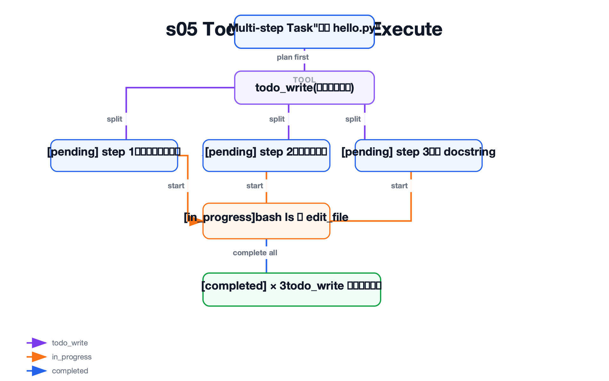

### 实现

`TodoWriteTool.execute()` — 带校验的全量替换：

```java
public ToolResult execute(JSONObject input) {
    JSONArray todos = todosArray(input);
    if (todos == null) {
        return new ToolResult("Error: todos must be an array");
    }
    List<TodoItem> nextTodos = new ArrayList<>();
    for (int i = 0; i < todos.size(); i++) {
        JSONObject item = todos.getJSONObject(i);
        String content = item.getString("content");
        String status = item.getString("status");
        if (content == null || content.isBlank()) {
            return new ToolResult("Error: todos[" + i + "] missing content");
        }
        if (!Arrays.asList("pending", "in_progress", "completed").contains(status)) {
            return new ToolResult("Error: todos[" + i + "] has invalid status: " + status);
        }
        nextTodos.add(new TodoItem(content, status));
    }
    currentTodos.clear();
    currentTodos.addAll(nextTodos);  // 全量替换，不是追加
    return new ToolResult("Updated " + currentTodos.size() + " tasks\n" + render());
}
```

输入格式：

```json
{
  "todos": [
    {"content": "检查文件是否存在", "status": "in_progress"},
    {"content": "补充类型标注", "status": "pending"},
    {"content": "验证语法", "status": "pending"}
  ]
}
```

### 遗留问题

- Todo 只存在内存，会话结束就没了，不能跨会话恢复 → **s10 Task System** 做持久化任务图
- 复杂子任务塞在同一上下文会越来越乱 → **s06 Subagent** 用干净上下文独立完成

## s06 Subagent

**教学分支：** `s06-subagent`

### 问题

父 Agent 的上下文已经很拥挤时，复杂子任务继续塞在同一个 `messages` 里会越来越乱——工具调用和结果混在一起，模型注意力被无关历史分散。怎么让子任务在干净的上下文中独立执行，只把结果摘要带回来？

### 功能

把「委托子任务」做成一个 `task` 工具。子 Agent 用全新的 `messages` 和独立的 `AgentLoop` 执行，父 Agent 只收到最终文本摘要，看不到中间过程。

新增：

- `TaskTool`：工具名 `task`，输入 `description`，内部启动子 Agent，返回摘要
- `AgentLoop` 增加 `maxTurns` 构造参数（默认 20，子 Agent 设为 30）

### 设计

```text
Parent messages[] → task(description)
                  → Subagent messages[] = [description]（全新上下文）
                  → Subagent tools: bash/read_file/write_file/edit_file/glob
                  → 独立循环，不共享 history
                  → summary text → Parent tool_result
```

关键边界设计：

- **不可递归**：子 Agent 不注册 `task` 工具，防止无限委托
- **简化工具集**：子 Agent 只有基础文件操作 + bash，不给 todo、权限、hook 等父级工具
- **上下文隔离**：子 Agent 的中间工具调用和历史消息完全不带回父 Agent，父 Agent 只收到最终文本摘要
- **更多步数**：子 Agent `maxTurns=30`（父 Agent 默认 20），给子任务更多执行空间


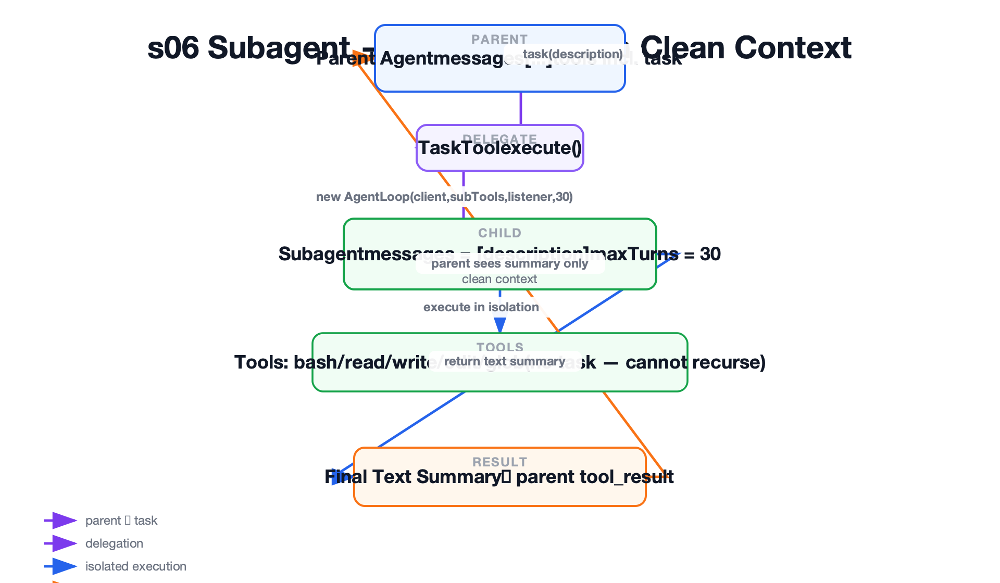

### 实现

`TaskTool` — 子 Agent 工具和 LLM 客户端由构造函数注入（不在 execute 内创建）：

```java
public class TaskTool implements Tool {
    private final LlmClient subagentClient;
    private final ToolRegistry subagentTools;

    public TaskTool(LlmClient subagentClient, ToolRegistry subagentTools) {
        this.subagentClient = subagentClient;
        this.subagentTools = subagentTools;
    }

    public ToolResult execute(JSONObject input) {
        String description = input.getString("description");
        if (description == null || description.isBlank()) {
            return new ToolResult("Error: No description provided");
        }
        System.out.println("[Subagent spawned]");
        // 子 Agent 不复用父 Agent 的 history，这是"干净上下文"的核心
        AgentLoop subLoop = new AgentLoop(subagentClient, subagentTools, listener, 30);
        AssistantMessage answer = subLoop.run(description);
        System.out.println("[Subagent done]");
        // 父 Agent 只拿到最终文本摘要，不拿到子 Agent 的完整中间消息
        return new ToolResult(extractText(answer));
    }
}
```

Demo 中的装配 — 子工具池不含 task，TaskTool 注入子 Agent 的 client 和 tools：

```java
// 子工具池：基础文件操作 + bash，不包含 task（防止递归委托）
ToolRegistry subTools = baseTools(workdir);
// 父工具池：基础工具 + task（注入子 Agent 的 client 和 tools）
ToolRegistry parentTools = baseTools(workdir)
        .register(new TaskTool(new AnthropicLlmClient(subConfig), subTools));
```

### 遗留问题

- 子 Agent 不带技能说明，某些专业任务不知道怎么做 → **s07 Skill Loading** 解决
- 上下文还是会持续增长，没有主动压缩机制 → **s08 Context Compact** 解决

## s07 Skill Loading

**教学分支：** `s07-skill-loading`

### 问题

Agent 可能有很多技能说明（代码审查、测试规范、部署流程），但把所有 `SKILL.md` 全塞进 system prompt 会浪费上下文，每个技能的正文可能上千字。怎么让 Agent 知道有哪些技能可用，但只在需要时加载正文？

### 功能

启动时只注入技能目录（名字 + 描述），真正需要时通过 `load_skill` 工具按需加载正文。两层加载：便宜层常驻 prompt，昂贵层按需展开。

新增：

- `Skill`：数据类，保存 `name`、`description`、`body`
- `SkillRegistry`：扫描 `skills/*/SKILL.md`，解析 YAML frontmatter，用 name/description 生成目录
- `LoadSkillTool`：工具名 `load_skill`，按技能名返回 `<skill name="...">正文</skill>`

### 设计

两层加载，跟 s09 Memory 同样的「索引在 prompt，正文按需取」思路：

```text
system prompt: "可用技能：code-review（代码审查）、java-cli（Java CLI 规范）"
                                        ↓
模型需要 code-review 时 → load_skill("code-review")
                                        ↓
返回 <skill name="code-review">检查命名、异常处理、测试覆盖...</skill>
                                        ↓
注入当前对话，模型按技能规范执行
```

关键设计决策：

- **只列目录，不塞正文**：`SkillRegistry.getDescriptions()` 只输出「名字：描述」列表放入 system prompt，几乎不占 token
- **按名查找，防路径穿越**：`load_skill` 只接受已扫描到的技能名，不接受文件路径
- **XML 标签包裹**：加载后的正文用 `<skill name="...">` 包裹，让模型明确知道这是技能指令


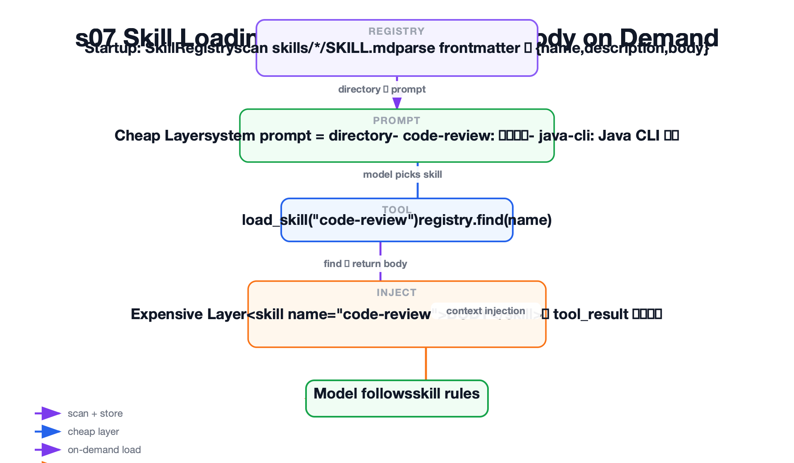

### 实现

`SkillRegistry` — 扫描 `skills/*/SKILL.md`，解析 YAML frontmatter：

```java
public class SkillRegistry {
    private final Map<String, Skill> skills = new LinkedHashMap<>();

    public SkillRegistry(File skillsDir) {
        File[] dirs = skillsDir.listFiles(File::isDirectory);
        for (File dir : dirs) {
            File skillFile = new File(dir, "SKILL.md");
            if (!skillFile.isFile()) continue;
            String raw = Files.readString(skillFile.toPath(), StandardCharsets.UTF_8);
            Skill skill = parse(dir.getName(), raw);  // fallbackName = 目录名
            skills.put(skill.getName(), skill);
        }
    }

    private Skill parse(String fallbackName, String raw) {
        String name = fallbackName;
        String body = raw;
        if (raw.startsWith("---")) {
            String[] parts = raw.split("---", 3);
            // 解析 frontmatter 中的 name: / description:
            for (String line : parts[1].split("\\R")) {
                if (line.startsWith("name:")) name = line.substring(5).trim();
                else if (line.startsWith("description:")) description = line.substring(12).trim();
            }
            body = parts[2].trim();  // frontmatter 之后的内容是正文
        }
        return new Skill(name, description, body);
    }

    public String getDescriptions() {
        // 目录只放技能名和一句话描述
        StringBuilder sb = new StringBuilder();
        for (Skill skill : skills.values()) {
            sb.append("  - ").append(skill.getName()).append(": ").append(skill.getDescription()).append("\n");
        }
        return sb.toString();
    }
}
```

`LoadSkillTool.execute()` — 按名查找，`<skill>` 标签包裹返回：

```java
public ToolResult execute(JSONObject input) {
    String name = input.getString("name");
    Skill skill = skillRegistry.find(name);
    if (skill == null) {
        return new ToolResult("Skill not found: " + name);
    }
    return new ToolResult("<skill name=\"" + skill.getName() + "\">\n"
        + skill.getBody() + "\n</skill>");
}
```

技能文件示例 `skills/code-review/SKILL.md`：

```markdown
---
name: code-review
description: 代码审查技能
---
审查代码时，请检查以下方面：
1. 命名规范
2. 异常处理
3. 测试覆盖
4. 潜在的性能问题
```

### 遗留问题

- 对话历史越来越长，即使技能按需加载，上下文还是持续增长会满 → **s08 Context Compact** 解决
- 技能文件是静态的，没有用户偏好和项目事实的持久记忆 → **s09 Memory** 解决

## s08 Context Compact

**教学分支：** `s08-context-compact`

### 问题

工具输出和多轮对话持续挤占上下文窗口。模型上下文有上限（如 200K token），满了就报 `prompt_is_too_long` 错误或静默截断。怎么在 LLM 调用前主动腾空间？

### 功能

在 AgentLoop 调用 LLM 前插入四层压缩管线，按成本和保真度从低到高依次执行。同时提供 `compact` 工具让模型显式触发摘要。

新增：

- `CompactingAgentLoop`：s08 专用循环，在 LLM 调用前运行压缩管线，拦截 `compact` 工具特殊处理
- `CompactionPipeline`：按固定顺序执行四层压缩
- `MessageInspector`：判断消息是否含 tool_use/tool_result、估算消息大小
- `ToolResultStore`：大工具结果落盘到 `.task_outputs/tool-results/`
- `TranscriptStore`：压缩前保存完整历史到 `.transcripts/transcript_*.jsonl`
- `CompactTool`：暴露 `compact` 工具定义，真正压缩由循环处理

### 设计

四层压缩，按开销从低到高依次执行：

```text
1. toolResultBudget（最后一条 tool_result > 200KB）
   → 原文落盘，上下文中只留文件路径 + 截断预览
2. snipCompact（消息数 > 50 条）
   → 裁掉中间历史，保留前 3 条和后 47 条
   → 保护 assistant(tool_use) 和 user(tool_result) 配对被拆散
3. microCompact（旧 tool_result 太多）
   → 保留最近 3 条完整结果，旧的替换为 "[Earlier tool result compacted. Re-run if needed.]"
4. compactHistory（还是 > 50KB）
   → 最终手段：调 LLM 生成摘要，摘要前保存完整 transcript 到 .transcripts/
```

关键设计决策：

- **顺序不能换**：便宜的、保真度高的先做，昂贵的 LLM 摘要最后才用
- **pair 保护**：snipCompact 裁剪时不能拆散 `assistant(tool_use)` 和紧接着的 `user(tool_result)`，否则 Anthropic API 会因为不配对而拒绝请求
- **compact 工具特殊处理**：模型调用 `compact` 时，循环自己执行压缩（工具不真正执行），并手动把 `tool_use` 和 `tool_result` 配对补回 messages，避免下一轮 API 收到不完整的工具调用
- **被动压缩**：除了四层主动压缩管线，当 LLM 返回 `prompt_is_too_long` 错误时，循环自动执行 `compactHistory` 摘要并重试，不把错误暴露给用户


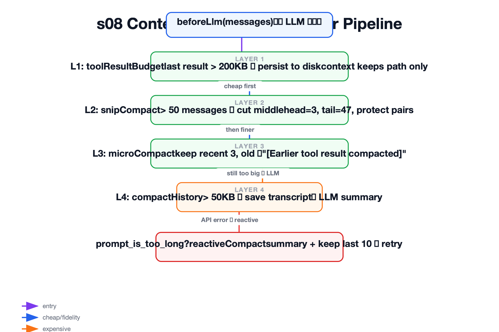

### 实现

`CompactionPipeline` — 四个私有方法 + 两个公共入口：

```java
public class CompactionPipeline {
    private static final int MAX_MESSAGES = 50;
    private static final int KEEP_RECENT_TOOL_RESULTS = 3;
    private static final int TOOL_RESULT_BUDGET = 200_000;   // 200KB
    private static final int AUTO_COMPACT_THRESHOLD = 50_000; // 50KB

    // 每轮 LLM 调用前自动执行（不报错，尽量腾空间）
    public void beforeLlm(List<Message> messages) {
        toolResultBudget(messages);   // 第 1 层
        snipCompact(messages);        // 第 2 层
        microCompact(messages);       // 第 3 层
        if (inspector.estimateSize(messages) > AUTO_COMPACT_THRESHOLD) {
            replaceAll(messages, compactHistory(messages, "auto compact"));  // 第 4 层
        }
    }

    // 模型调 compact 工具或 prompt_is_too_long 时触发
    public List<Message> compactHistory(List<Message> messages, String focus) {
        transcriptStore.write(messages);  // 先保存完整 transcript
        AssistantMessage summary = summaryClient.chat(
            List.of(Message.user("Summarize: ..." + focus)), List.of());
        return List.of(Message.user("[Compacted]\n\n" + extractText(summary)));
    }

    // prompt_is_too_long 后的被动压缩：保留最近 10 条 + 摘要
    public List<Message> reactiveCompact(List<Message> messages) {
        List<Message> compacted = new ArrayList<>(compactHistory(messages, "reactive"));
        int start = Math.max(0, messages.size() - 10);
        for (int i = start; i < messages.size(); i++) compacted.add(messages.get(i));
        return compacted;
    }
}
```

`CompactingAgentLoop` — LLM 调用前跑管线 + 捕获 `prompt_is_too_long`：

```java
// 每轮 LLM 调用前
pipeline.beforeLlm(messages);

try {
    response = llmClient.chat(messages, toolDefinitions());
} catch (PromptTooLongException e) {
    // 被动压缩：摘要 + 保留最近历史
    messages = pipeline.reactiveCompact(messages);
    response = llmClient.chat(messages, toolDefinitions());
}
```

### 遗留问题

- 压缩会丢失用户偏好和反馈等隐性信息 → **s09 Memory** 在压缩前提取记忆
- 压缩管线参数（阈值、保留条数）硬编码 → 生产系统需要可配置

## s09 Memory

**教学分支：** `s09-memory`

### 问题

上下文压缩会丢掉用户偏好（"我喜欢 tab 缩进"）、项目事实（"这个项目用 Java 17"）和反馈（"上次那个方案不行"）。这些信息不应该只存在对话历史里——历史会被压缩清掉。怎么持久化该记的，忘掉该忘的？

### 功能

把记忆存成 `.memory/` 下的 Markdown 文件，用 `MEMORY.md` 索引常驻 prompt，正文按需注入。三个子系统各司其职：筛选（选相关记忆）、提取（从对话中提取新记忆）、整理（去重合并）。

新增：

- `Memory`：数据类，filename、name、description、type、body
- `MemoryStore`：管理 `.memory/*.md` 文件和 `.memory/MEMORY.md` 索引
- `MemorySelector`：根据当前请求选择最多 5 条相关记忆，LLM 失败时关键词降级
- `MemoryExtractor`：每轮结束后从压缩前快照中提取新记忆
- `MemoryConsolidator`：记忆文件达到 10 个时合并去重
- `MemoryManager`：组合筛选、提取、整理三个子系统
- `MemoryAgentLoop`：包装 s08 压缩循环，每轮前后注入记忆逻辑

### 设计

跟 s07 技能加载同一个思路——索引在 prompt，正文按需取：

```text
每轮开始：
  1. 注入 MEMORY.md 索引到 system prompt（便宜）
  2. MemorySelector 根据当前请求选最多 5 条相关记忆
  3. 相关记忆正文包在 <relevant_memories> 中注入

每轮结束：
  4. 在压缩前保存 messages 快照
  5. MemoryExtractor 从快照中提取新记忆（用压缩前快照，避免细节被抹掉）
  6. 写入 .memory/{name}.md，更新 MEMORY.md 索引

整理：
  7. 记忆文件达到 10 个时触发 MemoryConsolidator，合并去重
```

记忆文件格式（`.memory/user-preference-tabs.md`）：

```markdown
---
name: user-preference-tabs
description: User prefers tabs for indentation
type: user
---

User prefers using tabs, not spaces, for indentation.
```

`MEMORY.md` 索引格式：

```markdown
- [user-preference-tabs](user-preference-tabs.md) — User prefers tabs for indentation
```

关键设计决策：

- **提取用压缩前快照**：压缩会把细节抹掉，用户偏好和反馈里的 nuance 可能被摘要吞掉，所以提取必须在压缩前做
- **MS 降级兜底**：MemorySelector 优先用 LLM 选相关记忆，LLM 调用失败时用关键词匹配保底
- **去重而非覆盖**：新记忆写入前跟已有记忆比对 name + description，重复的跳过而非覆盖
- **整理阈值简单化**：教学版只用「文件数达到 10」触发整理，不做时间门控和后台 Dream


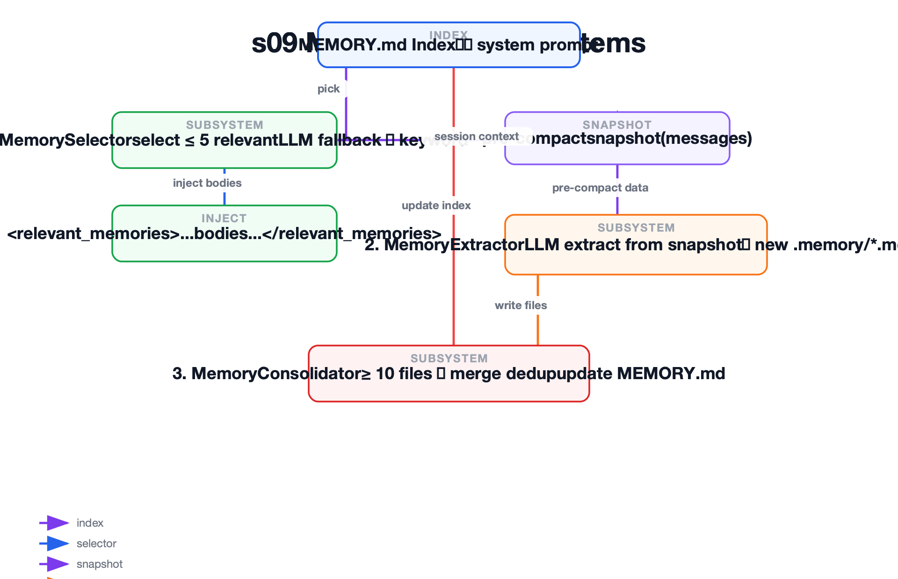

### 实现

`MemoryAgentLoop.run()` — 极简包装，快照由外部传入，提取委托给 MemoryManager：

```java
public class MemoryAgentLoop {
    private final CompactingAgentLoop compactingLoop;
    private final MemoryManager memoryManager;

    public AssistantMessage run(List<Message> messages, List<Message> preCompactSnapshot) {
        AssistantMessage answer = compactingLoop.run(messages);
        // 提取记忆要使用压缩前的上下文，避免摘要抹掉用户偏好、反馈等细节
        memoryManager.afterTurn(preCompactSnapshot);
        return answer;
    }

    // snapshot() 方法在 demo 中调用，深拷贝所有 ContentBlock 类型
    public List<Message> snapshot(List<Message> messages) { ... }
}
```

Demo 中的调用顺序：

```java
// 每轮开始：注入相关记忆到 system prompt
List<Memory> relevant = memoryManager.selectRelevant(query);
// ... 重建 system prompt，包入 <relevant_memories>

// 压缩前保存快照
List<Message> snapshot = memoryLoop.snapshot(history);

// 运行 MemoryAgentLoop（内部调用 s08 压缩循环）
AssistantMessage answer = memoryLoop.run(history, snapshot);
// afterTurn 在 run() 内部自动调用，从 snapshot 提取记忆
```

### 遗留问题

- 记忆只在当前会话结束前提取，没有后台 Dream 阶段做深度反思和整理 → 生产版需要后台记忆加工
- Todo 只存内存，任务列表不能跨会话恢复 → **s10 Task System** 持久化任务图

## s10 Task System

**教学分支：** `s10-task-system`

### 问题

s05 的 TodoWrite 只在内存里，会话结束就没了。大目标需要跨会话恢复、表达任务间的依赖顺序（A 完成才能做 B），并为后续多 Agent 协作准备一个共享的任务图。怎么把 Todo 从「会话内清单」升级为「持久化任务图」？

### 功能

引入持久化任务系统：每个任务存为 `.tasks/task_{id}.json`，支持状态机（pending → in_progress → completed）、依赖检查（blockedBy）和 owner 认领。

新增：

- `TaskRecord`：数据类，id、subject、description、status、owner、blockedBy
- `TaskStore`：管理 `.tasks/` 目录，任务 JSON 读写和列表扫描
- `TaskService`：状态机 + blockedBy 依赖检查
- `CreateTaskTool`：创建持久化任务，可带上游依赖
- `ListTasksTool`：列出所有任务的状态、owner 和依赖
- `GetTaskTool`：读取单个任务完整 JSON
- `ClaimTaskTool`：认领可开始的任务，设置 owner 并改为 in_progress
- `CompleteTaskTool`：完成任务，报告新解锁的下游任务

### 设计

跟 s05 TodoWrite 的定位区分：

| | TodoWrite (s05) | Task System (s10) |
|---|---|---|
| 定位 | 当前任务的执行清单 | 可跨会话恢复的任务图 |
| 存储 | 会话内存 | `.tasks/{id}.json` 持久化 |
| 依赖 | 无 | `blockedBy` 数组 |
| 生命周期 | 当前会话 | 跨会话保留 |
| 分工 | 不负责任务分配 | `owner` + claim |

状态机只有三种状态：

```text
pending → in_progress → completed
```

`claim_task` 是唯一从 pending 推进到 in_progress 的入口。认领前检查所有 blockedBy：
- 依赖任务不存在 → blocked
- 任一依赖不是 completed → blocked
- 所有依赖已完成 → 允许认领

`complete_task` 只允许完成 in_progress 的任务。完成后自动扫描所有 pending 任务，报告哪些任务的依赖刚刚被满足（Unblocked）。

任务持久化格式（`.tasks/task_1781770000000_0427.json`）：

```json
{
  "id": "task_1781770000000_0427",
  "subject": "setup database schema",
  "description": "Create initial database schema",
  "status": "pending",
  "owner": null,
  "blockedBy": []
}
```


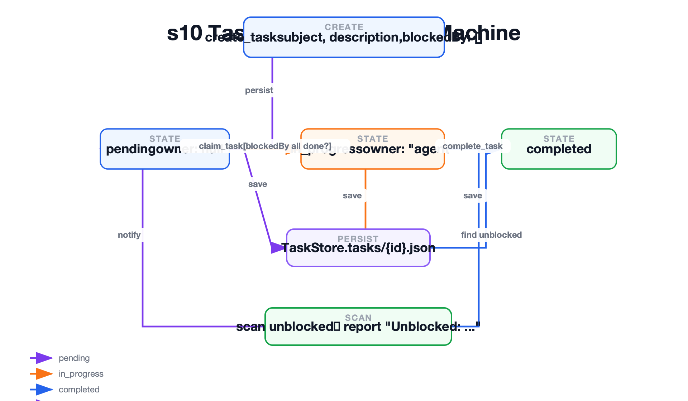

### 实现

`TaskService` — 状态机 + 依赖检查（返回消息字符串，不抛异常）：

```java
public class TaskService {
    private final TaskStore store;

    public String claimTask(String taskId, String owner) {
        TaskRecord task = store.load(taskId);
        if (!"pending".equals(task.getStatus())) {
            return "Task " + taskId + " is " + task.getStatus() + ", cannot claim";
        }
        List<String> blocked = blockingDependencies(task);
        if (!blocked.isEmpty()) {
            return "Blocked by: " + blocked;
        }
        task.setOwner(owner == null || owner.isBlank() ? "agent" : owner);
        task.setStatus("in_progress");
        store.save(task);
        return "Claimed " + task.getId() + " (" + task.getSubject() + ")";
    }

    public String completeTask(String taskId) {
        TaskRecord task = store.load(taskId);
        if (!"in_progress".equals(task.getStatus())) {
            return "Task " + taskId + " is " + task.getStatus() + ", cannot complete";
        }
        task.setStatus("completed");
        store.save(task);
        List<String> unblocked = findUnblockedSubjects();
        String msg = "Completed " + task.getId();
        if (!unblocked.isEmpty()) {
            msg += "\nUnblocked: " + String.join(", ", unblocked);
        }
        return msg;
    }

    private List<String> blockingDependencies(TaskRecord task) {
        List<String> blocked = new ArrayList<>();
        for (String depId : task.getBlockedBy()) {
            if (!store.exists(depId) || !"completed".equals(store.load(depId).getStatus()))
                blocked.add(depId);
        }
        return blocked;
    }
}
```

### 遗留问题

- 慢操作（npm install、docker build）Agent 同步等待，浪费时间 → **s11 Background Tasks** 解决
- 认领无并发保护，多 Agent 可能同时 claim 同一任务 → 教学版用 owner 检查兜底，生产需要文件锁

## s11 Background Tasks

**教学分支：** `s11-background-tasks`

### 问题

`npm install` 要 3 分钟，`docker build` 更久。Agent 同步等结果，期间不做任何事。怎么让慢操作在后台执行，Agent 继续处理其他工作？

### 功能

对 bash 工具引入后台执行路径。慢操作丢到 daemon 线程，立即返回占位结果让 Agent 继续思考，后台完成后以 `<task_notification>` XML 注入下一轮对话。

新增：

- `BackgroundTask`：数据类，bgId、toolUseId、command、status
- `BackgroundDecider`：两层判断逻辑（显式参数 + 关键词兜底）
- `BackgroundTasks`：daemon 线程管理器，ConcurrentHashMap + AtomicInteger 保证线程安全
- `BackgroundAgentLoop`：s11 专用循环，内置同步/后台两条执行路径和通知注入

### 设计

两条执行路径，由 BackgroundDecider 决定走哪条：

```text
工具调用 → BackgroundDecider.shouldRunBackground()
              ├─ false → 同步执行 → tool_result 立即返回
              └─ true  → daemon 线程 → 占位 tool_result → 下轮 <task_notification>
```

时序示例——Agent 不等 npm install：

```text
Turn 1: LLM → bash "npm install" (run_in_background=true)
        → [background] dispatched bg_0001
        → tool_result: "[Background task bg_0001 started]"
        → LLM: "已把 npm install 放后台，我先读一下 package.json"

Turn 2: LLM → read_file "package.json"（同步，毫秒级）
        → [background done] bg_0001 completed
        → 注入 <task_notification>
        → LLM 同时看到 package.json 内容 + npm install 完成通知
```

判断逻辑两层：

1. 模型显式设置 `run_in_background=true` → 直接走后台（主路径）
2. 命令含 `install/build/test/deploy/compile/docker/pip/npm/cargo/pytest/make` 等关键词 → 兜底

只对 bash 生效，read_file/write_file 等工具永远同步执行。

通知格式不复用原始 `tool_use_id`——原始调用已用占位 tool_result 回复了，后台完成是独立事件：

```xml
<task_notification>
  <task_id>bg_0001</task_id>
  <status>completed</status>
  <command>npm install</command>
  <summary>added 245 packages in 45s</summary>
</task_notification>
```


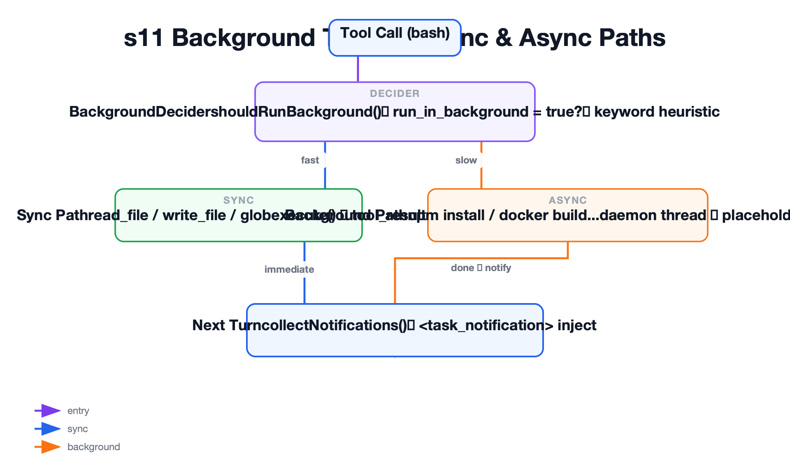

### 实现

`BackgroundAgentLoop.executeToolUses()` — 核心分派逻辑：

```java
private List<ToolResultBlock> executeToolUses(AssistantMessage response) {
    List<ToolResultBlock> results = new ArrayList<>();
    for (ContentBlock block : response.getContent()) {
        if (block instanceof ToolUseBlock) {
            ToolUseBlock toolUse = (ToolUseBlock) block;
            ToolResult result;
            if (BackgroundDecider.shouldRunBackground(toolUse.getName(), toolUse.getInput())) {
                // 后台路径：daemon 线程 + 占位 tool_result
                String bgId = backgroundTasks.start(toolUse, toolRegistry);
                result = new ToolResult("[Background task " + bgId + " started] ...");
            } else {
                // 同步路径
                result = executeTool(toolUse);
            }
            results.add(new ToolResultBlock(toolUse.getId(), result.getContent()));
        }
    }
    return results;
}

// 每轮 LLM 调用前，收集已完成通知注入为一条 user 消息
private void injectBackgroundNotifications(List<Message> messages) {
    List<String> notifications = backgroundTasks.collectNotifications();
    if (!notifications.isEmpty()) {
        StringBuilder sb = new StringBuilder();
        for (String notif : notifications) sb.append(notif).append("\n");
        messages.add(Message.user(sb.toString().trim()));
    }
}
```

### 遗留问题

- Agent 只在用户输入时才工作，无法定时自触发 → **s12 Cron Scheduler** 解决
- 后台任务无超时控制，线程泄漏风险 → 教学版靠 daemon 线程保证进程退出时自动终止

## s12 Cron Scheduler

**教学分支：** `s12-cron-scheduler`

### 问题

Agent 只在用户输入时才工作。如果想让 Agent 每天早上 9 点自动检查构建状态，或者在指定时间触发任务，目前做不到。怎么让 Agent 拥有定时自触发的能力？

### 功能

引入 cron 表达式驱动的定时调度器。Agent 可以注册、列出、取消定时任务，到点自动注入 `[Scheduled]` 消息运行 Agent。支持持久化，重启后恢复。

新增：

- `CronJob`：数据类，id、cron 表达式、prompt、recurring、durable
- `CronStore`：持久化 durable 任务到 `.scheduled_tasks.json`
- `CronScheduler`：委托 Hutool CronUtil，两层校验（5 段检查 + CronPattern.of 解析），触发时回调 `Consumer<CronJob>`
- `ScheduleCronTool`：注册 cron 任务
- `ListCronsTool`：列出活跃任务
- `CancelCronTool`：取消任务

### 设计

用 Hutool CronUtil 实现，不引入新依赖、不自写 cron 解析器：

```text
schedule_cron("0 9 * * *", "检查构建状态")
  → CronScheduler.schedule()
  → Hutool CronUtil 注册定时任务
  → 到点触发 callback
  → agentLock 内注入 [Scheduled] 检查构建状态
  → BackgroundAgentLoop.run()
```

关键设计决策：

- **agentLock 串行化**：cron 触发和用户输入不能同时运行 Agent，共享同一份 `history`。用 `synchronized` 保护，cron 触发时如果 Agent 正忙则排队等待
- **两层校验**：先用 5 段式正则检查基本格式，再用 Hutool `CronPattern.of()` 解析语义，格式错误在注册时就报出来
- **持久化**：`durable=true` 的任务写入 `.scheduled_tasks.json`，启动时从文件重新注册到 Hutool，恢复定时触发
- **两个触发源，一个循环**：cron 触发时构造 `[Scheduled] <prompt>` 作为用户消息注入，跟手动输入走同一个 AgentLoop


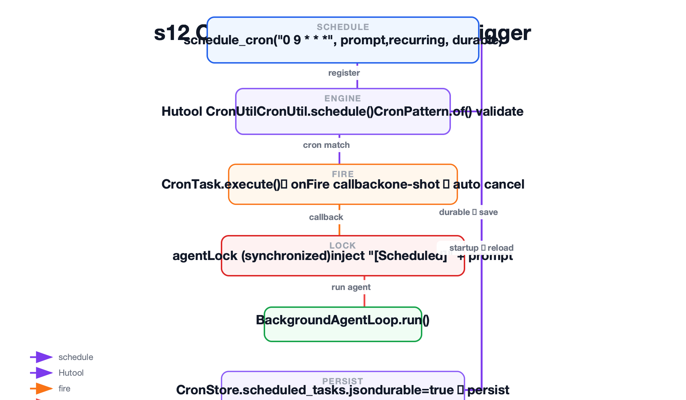

### 实现

`CronScheduler` — 构造函数注入 `Consumer<CronJob>` 回调，`schedule()` 返回消息字符串：

```java
public class CronScheduler {
    private final CronStore store;
    private final Consumer<CronJob> onFire;
    private final Map<String, CronJob> jobs = new ConcurrentHashMap<>();

    public CronScheduler(CronStore store, Consumer<CronJob> onFire) {
        this.store = store;
        this.onFire = onFire;
    }

    public void start() {
        // 从磁盘加载 durable job 并重新注册到 Hutool
        for (CronJob job : store.load()) {
            jobs.put(job.getId(), job);
            CronUtil.schedule(job.getId(), job.getCron(), new CronTask(job.getId()));
        }
        CronUtil.setMatchSecond(false);
        CronUtil.start();
    }

    public String schedule(String cron, String prompt, boolean recurring, boolean durable) {
        String err = validateCron(cron);
        if (err != null) return "Error: " + err;
        String id = "cron_" + Integer.toHexString(ThreadLocalRandom.current().nextInt(0x1000000));
        CronJob job = new CronJob(id, cron, prompt, recurring, durable);
        jobs.put(id, job);
        CronUtil.schedule(id, cron, new CronTask(id));
        if (durable) store.save(new ArrayList<>(jobs.values()));
        return "Scheduled " + id + ": " + prompt;
    }

    // 内部 CronTask：触发时从 jobs map 查找并回调 onFire，一次性任务自动取消
    private class CronTask implements Task {
        public void execute() {
            CronJob job = jobs.get(jobId);
            if (job != null) { onFire.accept(job); }
            if (!job.isRecurring()) cancel(jobId);
        }
    }
}
```

Demo 中构造 CronScheduler，agentLock 在回调中保护：

```java
CronScheduler scheduler = new CronScheduler(new CronStore(workdir), job -> {
    synchronized (agentLock) {
        agentLoop.run("[Scheduled] " + job.getPrompt());
    }
});
scheduler.start();
```

### 遗留问题

- 单个 Agent 处理所有事，复杂任务超出单个注意力范围 → **s13 Agent Teams** 解决
- cron 触发和用户输入共用 history，用户输入优先 → 合理的教学简化，生产系统需要独立的会话管理

## s13 Agent Teams

**教学分支：** `s13-agent-teams`

### 问题

单个 Agent 处理复杂任务时，上下文和注意力不够用。比如既要写后端 schema，又要写前端组件，两个方向混在一个 messages 里互相干扰。怎么让多个 Agent 并行干活，各自在自己的上下文里独立工作？

### 功能

让 Lead Agent 通过 `spawn_teammate` 工具启动队友 daemon 线程。每个队友用自己的 AgentLoop 和独立 messages，通过文件邮箱（`.mailboxes/*.jsonl`）跟 Lead 通信。

新增：

- `TeamMessage`：数据类，from、to、type、content、timestamp
- `MessageBus`：文件邮箱，追加到 `.mailboxes/{to}.jsonl`，读取后删除（消费式）
- `SpawnTeammateTool`：启动队友 daemon 线程，activeTeammates 防止同名重复启动
- `SendMessageTool`：向指定 Agent 的邮箱写入消息
- `CheckInboxTool`：消费当前 Agent 的 inbox

### 设计

```text
Lead: spawn_teammate("alice", "backend developer", "创建 schema.sql")
  → SpawnTeammateTool 启动 daemon 线程，maxTurns=10
  → alice 独立 AgentLoop + 独立 messages
  → alice 工具集：bash/read_file/write_file/send_message（无 spawn_teammate）
  → alice send_message("lead", "schema.sql 已完成")
  → MessageBus 追加 .mailboxes/lead.jsonl
  → Lead 每轮后自动读取 inbox，注入 <inbox>...</inbox> 到 history
```

关键设计决策：

- **文件邮箱**：每个 Agent 一个 `.mailboxes/{name}.jsonl`，读取后删除整个文件（消费式），保证消息不会被重复处理
- **队友不可递归创建**：队友工具集不包含 `spawn_teammate`，防止无限派生
- **harness 自动注入 inbox**：队友不注册 `check_inbox`，每轮 LLM 调用前由 harness 自动读 inbox 并注入 `<inbox>` 标签——队友不需要主动检查邮件
- **去重**：`activeTeammates`（ConcurrentHashMap keySet）防止同名队友重复启动
- **不持久化队友状态**：教学版队友运行状态只在进程内，进程退出不恢复


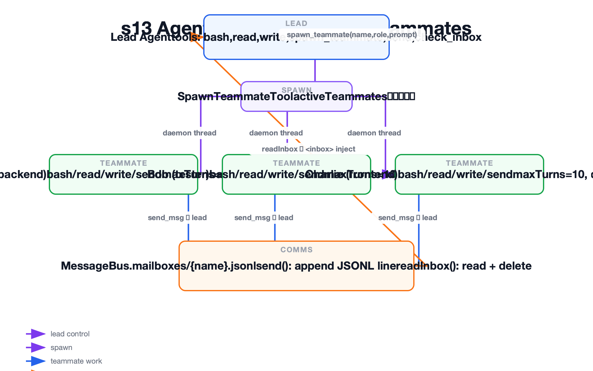

### 实现

`SpawnTeammateTool` — 输入字段为 `prompt`（非 `task`），队友独立运行完整循环：

```java
public ToolResult execute(JSONObject input) {
    String name = input.getString("name");
    String role = input.getString("role");
    String prompt = input.getString("prompt");  // 输入字段是 prompt
    if (!activeTeammates.add(name)) {
        return new ToolResult("Teammate '" + name + "' already exists");
    }
    Thread thread = new Thread(() -> runTeammate(name, role, prompt),
        "mini-claude-code-teammate-" + name);
    thread.setDaemon(true);
    thread.start();
    return new ToolResult("Teammate spawned: " + name);
}

private void runTeammate(String name, String role, String prompt) {
    // 队友创建自己的 ToolRegistry + LlmClient（无 spawn_teammate）
    ToolRegistry registry = new ToolRegistry()
        .register(new BashTool(workdir))
        .register(new ReadFileTool(workdir))
        .register(new WriteFileTool(workdir))
        .register(new SendMessageTool(bus, name));
    LlmClient client = new AnthropicLlmClient(config(promptTemplate, name, role));
    // 队友循环：每轮前 injectTeammateInbox，模型不注册 check_inbox
    AssistantMessage answer = runTeammateLoop(name, prompt, client, registry);
    bus.send(name, "lead", extractText(answer), "result");
    activeTeammates.remove(name);
}
```

`MessageBus` — `send()` 用四个字符串参数，`readInbox()` 消费后删除：

```java
public void send(String from, String to, String content, String type) {
    TeamMessage msg = new TeamMessage(from, to, type, content);
    File inbox = new File(mailboxesDir, to + ".jsonl");
    Files.writeString(inbox.toPath(), JSON.toJSONString(msg) + "\n",
        StandardOpenOption.CREATE, StandardOpenOption.APPEND);
}

public List<TeamMessage> readInbox(String agentName) {
    File inbox = new File(mailboxesDir, agentName + ".jsonl");
    if (!inbox.exists()) return Collections.emptyList();
    List<String> lines = Files.readAllLines(inbox.toPath());
    inbox.delete();  // 消费后删除
    return lines.stream().map(l -> JSON.parseObject(l, TeamMessage.class)).collect(toList());
}
```

### 遗留问题

- 队友间只有普通文本消息，Lead 没法区分「这个回复对应哪个请求」→ **s14 Team Protocols** 解决
- 队友由 Lead 手动分配任务，不会自己找活干 → **s15 Autonomous Agents** 解决

## s14 Team Protocols

**教学分支：** `s14-team-protocols`

### 问题

s13 的队友间只有普通文本消息，Lead 没法判断「这个回复对应哪个请求」。比如 Lead 同时让 alice 关机、让她提交计划，收到两条回复时分不清谁对应谁。怎么给队友间通信加上请求-响应匹配？

### 功能

引入协议消息系统：用 `request_id` 标记每个请求，`ProtocolService` 维护 pending 请求表，响应到达时自动匹配并更新状态。支持 shutdown 和 plan 两种协议。

新增：

- `ProtocolState`：数据类，requestId、type、sender、target、status、payload、timestamp
- `ProtocolService`：创建请求（自增 request_id）、匹配响应、按消息类型分发
- `RequestShutdownTool`：Lead 发起关机握手（shutdown_request）
- `RequestPlanTool`：Lead 要求队友先提交计划
- `SubmitPlanTool`：队友提交计划到 Lead inbox（plan_approval_request）
- `ReviewPlanTool`：Lead 根据 request_id 批准或拒绝计划（plan_approval_response）
- `ProtocolCheckInboxTool`：Lead 读取 inbox 时先路由协议响应，避免状态丢失

### 设计

关机协议（shutdown handshake）：

```text
Lead request_shutdown("alice", "任务完成，可以关闭")
  → ProtocolService 创建 ProtocolState(req_001, shutdown, pending)
  → MessageBus 写入 shutdown_request + metadata.request_id=req_001
  → alice idle loop 读到 inbox
  → ProtocolService.handleTeammateProtocolMessage 回复 shutdown_response + request_id=req_001
  → Lead consumeLeadInbox 匹配 req_001，状态 → approved
  → alice 退出
```

计划审批协议（plan approval）：

```text
Lead request_plan("bob", "重构认证模块")
  → bob submit_plan("将分三步重构...")
  → plan_approval_request 写入 Lead inbox（request_id=req_002）
  → Lead review_plan(req_002, true, "方案批准")
  → plan_approval_response 写回 bob inbox
```

关键设计决策：

- **request_id 匹配**：ProtocolService 用自增计数器生成唯一 id，响应中带回同一个 id，Lead 在 `consumeLeadInbox` 中自动匹配并更新 pending 状态
- **队友 idle loop**：队友完成当前工作后不立即退出，每秒轮询 inbox（`idleUntilMessage`），收到 shutdown 就退出，收到普通消息就继续工作
- **协议消息优先路由**：`ProtocolCheckInboxTool` 在返回普通消息前先过滤协议消息，交给 `ProtocolService` 处理，防止协议响应被当作普通消息漏掉
- **强约束未实现**：计划提交后被批准或拒绝，但教学版不做「未批准就禁止执行」的硬门控，靠 prompt 约束


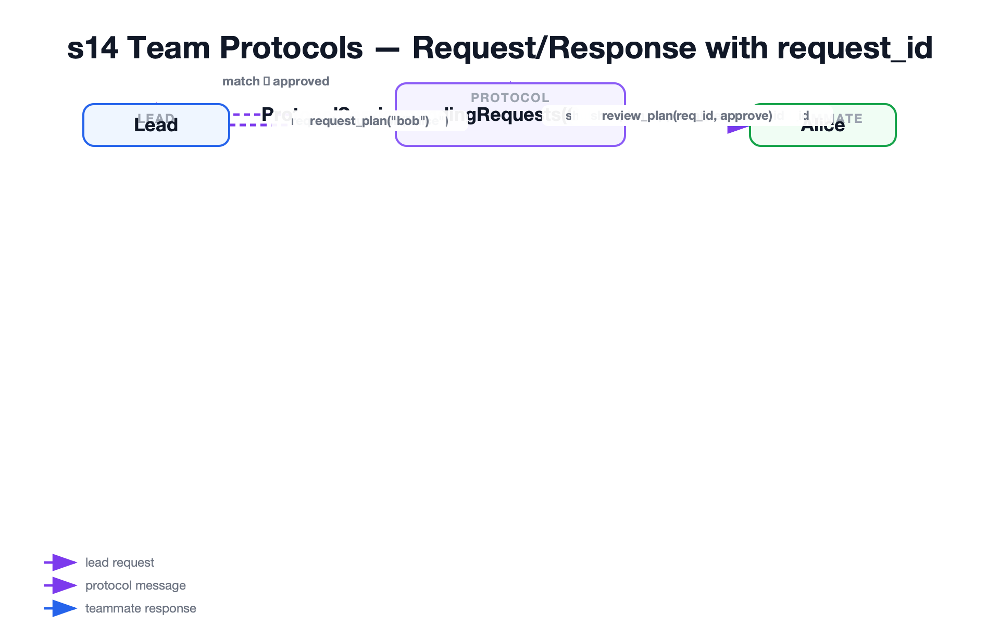

### 实现

`ProtocolService` — 请求创建与响应匹配：

```java
public class ProtocolService {
    private final Map<String, ProtocolState> pending = new ConcurrentHashMap<>();
    private final AtomicInteger requestCounter = new AtomicInteger(1);

    public ProtocolState createRequest(String type, String target, String payload) {
        String requestId = "req_" + requestCounter.getAndIncrement();
        ProtocolState state = new ProtocolState(requestId, type, "lead", target, "pending", payload);
        pending.put(requestId, state);
        return state;
    }

    public ProtocolState matchResponse(String requestId, String status, String payload) {
        ProtocolState state = pending.get(requestId);
        if (state != null) {
            state.setStatus(status);
            state.setPayload(payload);
        }
        return state;
    }

    public void handleTeammateProtocolMessage(TeamMessage msg, Consumer<TeamMessage> replyFn) {
        // 根据消息类型自动回复
        if ("shutdown_request".equals(msg.getType())) {
            replyFn.accept(new TeamMessage(msg.getTo(), msg.getFrom(),
                "shutdown_response", "acknowledged", msg.getMetadata().get("request_id")));
        }
    }
}
```

Shutdown 工具 — Lead 发起握手：

```java
public ToolResult execute(JSONObject input) {
    String teammate = input.getString("teammate");
    String reason = input.getString("reason");
    ProtocolState state = protocolService.createRequest("shutdown", teammate, reason);
    messageBus.send(new TeamMessage("lead", teammate, "shutdown_request", reason,
        Map.of("request_id", state.getRequestId())));
    return new ToolResult("[Shutdown requested] request_id=" + state.getRequestId());
}
```

### 遗留问题

- 队友靠轮询 inbox 等待消息，不会主动扫任务板找活 → **s15 Autonomous Agents** 解决
- 协议只覆盖 shutdown 和 plan 两种场景 → 生产版需要更完整的 Agent Communication Protocol

## s15 Autonomous Agents

**教学分支：** `s15-autonomous-agents`

### 问题

s14 的队友靠轮询 inbox 等待消息——Lead 不发话，队友就闲着。但任务板上可能有 pending 任务没人做。怎么让队友空闲时自己扫看板，有活就认领？

### 功能

队友 idle 时不再只等消息，而是每 5 秒扫一次 `.tasks/` 看板，找到 pending、无 owner、依赖已完成的任务后自动 claim 并开始工作。60 秒没活干就退出。

新增：

- `TaskService.scanUnclaimedTasks()`：扫描 pending、无 owner、依赖全部完成的任务
- `ClaimTaskTool` 增加 `defaultOwner` 注入：harness 把队友名固定为 owner，防止冒领
- `SpawnTeammateTool` 增加 autonomous 模式：传入 TaskService 时自动启用，队友工具池增加 list_tasks/claim_task/complete_task

### 设计

Pull 模式——队友自己拉任务，Lead 不逐个分配：

```text
Lead create_task("创建 schema.sql", blockedBy=[])
Lead create_task("创建 API", blockedBy=["task_schema"])
Lead spawn_teammate("alice", "backend", autonomous=true)
Lead spawn_teammate("bob", "fullstack", autonomous=true)

alice:
  → WORK 阶段完成初始上下文
  → IDLE：每 5 秒 poll
      先检查 inbox（协议消息优先）
      再 scanUnclaimedTasks() → 找到 "创建 schema.sql" → claimTask(taskId, "alice")
      → 注入 <auto-claimed>task: 创建 schema.sql</auto-claimed>
      → 回到 WORK 执行
      → 完成后 claim 下一个未锁定任务
  → 60 秒无 inbox 且无任务 → 退出

bob:
  → 同时运行，但 "创建 API" 依赖 schema → blocked → 不会认领
  → alice 完成 schema 后 → complete_task 报告 Unblocked: "创建 API"
  → bob 下轮 scanUnclaimedTasks → 找到 "创建 API" → claim → 执行
```

关键设计决策：

- **依赖感知**：`scanUnclaimedTasks()` 过滤掉有 blockedBy 未满足的任务，保证队友不会抢到还没准备好的工作
- **owner 防冒领**：队友的 `claim_task` 工具的 `defaultOwner` 被 harness 强制设为队友名（如 "alice"），工具定义中不暴露 owner 参数给模型
- **idle 双检查**：先 inbox（协议消息优先，shutdown 立即响应），再任务板。inbox 消息和任务板都空的才算真正的 idle
- **无文件锁**：教学版只用 owner 检查防冲突（已认领的不能重复 claim），极端并发下两个队友可能同时争同一任务


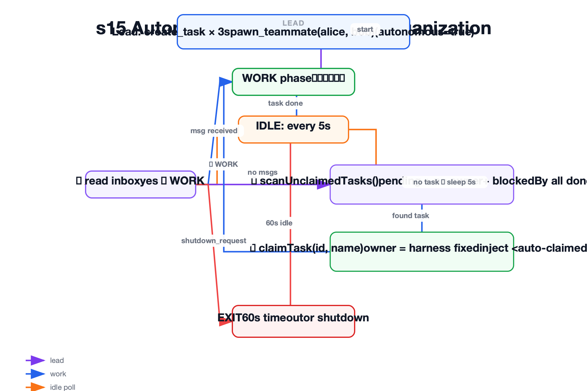

### 实现

队友 idle loop — 每 5 秒扫一次看板：

```java
private String idleUntilWork(String teammateName, TaskService taskService, MessageBus bus) {
    long idleStart = System.currentTimeMillis();
    while (System.currentTimeMillis() - idleStart < 60_000) {
        // 先检查 inbox
        List<TeamMessage> inbox = bus.readInbox(teammateName);
        for (TeamMessage msg : inbox) {
            if ("shutdown_request".equals(msg.getType())) {
                bus.send(new TeamMessage(teammateName, "lead", "shutdown_response",
                    "ack", msg.getMetadata().get("request_id")));
                return null;  // 退出
            }
            // 普通消息 → 继续工作
            return msg.getContent();
        }

        // 扫看板找未认领任务
        List<TaskRecord> unclaimed = taskService.scanUnclaimedTasks();
        if (!unclaimed.isEmpty()) {
            TaskRecord task = unclaimed.get(0);
            taskService.claimTask(task.getId(), teammateName);
            return "<auto-claimed>task: " + task.getSubject() + "</auto-claimed>";
        }

        try { Thread.sleep(5000); } catch (InterruptedException e) { break; }
    }
    return null;  // 60 秒无活，退出
}
```

### 遗留问题

- 无并发认领保护，极端情况下两个队友可能同时 claim 同一任务 → 生产需要文件锁或数据库事务
- 工具池固定，外部能力（MCP）没接入 → **s16 MCP Plugin** 解决

## s16 MCP Plugin

**教学分支：** `s16-mcp-plugin`

### 问题

到目前为止，工具池都是启动时写死的（BashTool、ReadFileTool 等）。如果 Agent 运行时需要新能力——比如查天气、操作 GitHub Issue——只能停下来加代码重启。怎么让 Agent 在运行时动态接入外部工具？

### 功能

通过 `connect_mcp` 工具连接外部 MCP Server，发现并注册其工具。工具池每轮动态重组，连接新 Server 后下一轮即可调用其工具。使用 mock server 演示，不依赖真实 MCP 服务。

新增：

- `McpManager`：维护已连接的 MCP Server 映射
- `McpClient`：接口，getName() / getTools() / callTool()
- `McpToolDefinition`：name、description、inputSchema、readOnly
- `McpToolName`：前缀命名 `mcp__{server}__{tool}`，防止冲突
- `McpTool`：适配器，把 MCP 工具调用转换成项目 `Tool` 接口
- `McpToolPool`：每轮组装 builtin + connect_mcp + 已连接 MCP 工具
- `DynamicMcpAgentLoop`：s16 专用循环，每轮 LLM 调用前重新组装工具池
- `MockMcpServers`：两个 mock server——time（`get_current_time`）和 weather（`get_current_weather`）

### 设计

```text
Turn 1: model → connect_mcp("weather")
        → McpManager.connect("weather")
        → 调用 McpClient.getTools() → 发现 get_current_weather
        → 注册到 McpManager
        → tool_result: "Connected to weather. Tools: mcp__weather__get_current_weather (readOnly)"

Turn 2: McpToolPool.assemble()
        → builtin tools: bash/read_file/write_file
        → + connect_mcp
        → + mcp__weather__get_current_weather（新连接的工具自动出现）
        → ToolRegistry

        model → mcp__weather__get_current_weather({"city":"Shanghai"})
        → McpTool 适配器 → McpClient.callTool("get_current_weather", {...})
        → 返回 mock 天气数据
```

两个 mock MCP Server：

```text
time
  └─ mcp__time__get_current_time (readOnly) → 使用 java.time 获取当前时间

weather
  └─ mcp__weather__get_current_weather (readOnly) → 使用内置 mock 数据返回天气
```

关键设计决策：

- **前缀防冲突**：所有 MCP 工具统一命名为 `mcp__{server}__{tool}`，不同 Server 不会撞名，模型也能一眼看出工具的来源
- **动态工具池**：每轮 LLM 调用前重新 assemble，新连接的 Server 工具自动出现在下一轮。循环本身不感知工具池的变化——仍然按工具名 dispatch
- **适配器模式**：`McpTool` 把 MCP 的 tool 定义和调用适配到项目已有的 `Tool` 接口，循环和 ToolRegistry 完全不关心工具是内置的还是 MCP 来的
- **readOnly 标注**：MCP 工具定义携带 readOnly 属性，模型和权限系统可以据此判断安全性
- **mock server**：教学版不依赖真实 MCP 协议（JSON-RPC、stdio/HTTP 传输），用 mock 保持学习重点在动态工具池


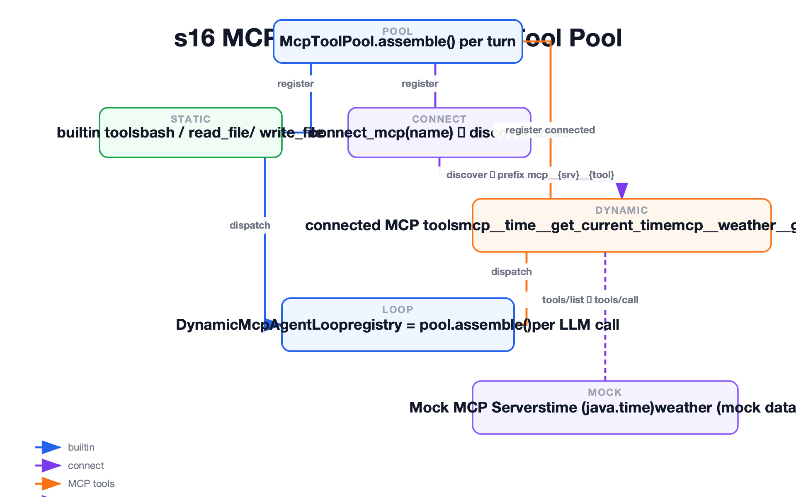

### 实现

`McpToolPool.assemble()` — 每轮动态组装：

```java
public class McpToolPool {
    private final List<Tool> builtinTools;
    private final McpManager mcpManager;

    public ToolRegistry assemble() {
        ToolRegistry registry = new ToolRegistry();
        // 1. 注册内置工具
        for (Tool tool : builtinTools) {
            registry.register(tool);
        }
        // 2. 注册 connect_mcp
        registry.register(new ConnectMcpTool(mcpManager));
        // 3. 注册所有已连接 MCP Server 的工具
        for (Map.Entry<String, McpClient> entry : mcpManager.getConnectedServers().entrySet()) {
            String serverName = entry.getKey();
            McpClient client = entry.getValue();
            for (McpToolDefinition def : client.getTools()) {
                String fullName = McpToolName.of(serverName, def.getName());
                registry.register(new McpTool(fullName, def, client));
            }
        }
        return registry;
    }
}
```

`DynamicMcpAgentLoop` — 每轮重组工具池：

```java
for (int turn = 0; turn < maxTurns; turn++) {
    // s16：每轮重新组装工具池
    ToolRegistry registry = toolPool.assemble();

    AssistantMessage msg = llmClient.chat(systemPrompt, history, registry.definitions());
    history.add(msg.toMessage());

    for (ToolUseBlock toolUse : msg.getToolUses()) {
        Tool tool = registry.find(toolUse.getName());
        if (tool != null) {
            ToolResult result = tool.execute(toolUse.getInput());
            history.add(Message.toolResult(toolUse.getId(), result.getContent()));
        }
    }
}
```

`MockMcpServers` — time 和 weather 两个 mock：

```java
public class MockMcpServers {
    public static McpClient createTimeServer() {
        return new McpClient() {
            public List<McpToolDefinition> getTools() {
                return List.of(new McpToolDefinition(
                    "get_current_time", "Returns the current time", ..., true));
            }
            public String callTool(String name, JSONObject args) {
                return LocalDateTime.now().toString();
            }
        };
    }

    public static McpClient createWeatherServer() {
        return new McpClient() {
            public List<McpToolDefinition> getTools() {
                return List.of(new McpToolDefinition(
                    "get_current_weather", "Returns weather for a city", ..., true));
            }
            public String callTool(String name, JSONObject args) {
                String city = args.getString("city");
                return city + ": 22°C, partly cloudy (mock)";
            }
        };
    }
}
```

### 遗留问题

- 使用 mock server，没有真实的 MCP 协议实现（JSON-RPC、stdio/HTTP 传输、tools/list 和 tools/call）→ 生产版需要完整的 MCP 客户端
- MCP 工具无权限管控，连接后即可调用 → s03 的权限管线可以扩展到 MCP 工具

